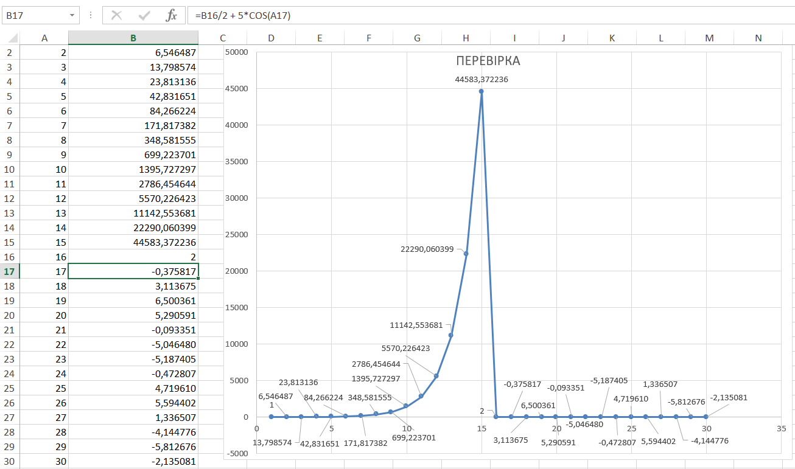

<p align="center"><b>МОНУ НТУУ КПІ ім. Ігоря Сікорського ФПМ СПіСКС</b></p>
<p align="center">
<b>Звіт з розрахунково-графічної роботи</b>
<br/><br/>
з дисципліни <br/> "Вступ до функціонального програмування"
</p>

<p align="right"><b>Студент: Вакульчук Ярослав Віталійович КВ-22
<p align="right"><b>Рік: 2025

## Завдання на розрахунково-графічну роботу

1. Реалізувати програму для обчислення функції згідно варіанту мовою Common Lisp. Варіант обирається згідно списку варіантів для лабораторних робіт за модулем 16: 1 -> 1, 2 -> 2, ..., 17 -> 1, 18 -> 2 і т.д.
1. Виконати тестування реалізованої програми.
1. Порівняти результати роботи програми мовою Common Lisp с розрахунками іншими засобами.

## Варіант завдання №2

<p align="center">
  
</p>

## Реалізації обчислення функції мовою Common Lisp
```lisp
(defun calculate-sequence ()
  (labels ((iter (i prev acc) 
             (if (> i 30)
                 (nreverse acc)
                 (let ((curr (cond
                               ((= i 1) 1.0d0)
                               ((<= i 15) (+ (* prev 2.0d0) (* 5.0d0 (sin (float i 1.0d0)))))
                               ((= i 16) 2.0d0)
                               (t (+ (/ prev 2.0d0) (* 5.0d0 (cos (float i 1.0d0))))))))
                   (iter (1+ i) curr (cons (cons i curr) acc)))))) ; Тут теж ITER
    (iter 1 0.0d0 '())))
```
## Функції виводу та запуску програми
```lisp
(defun print-results (data)
  (when data
    (let ((pair (car data)))
      (format t "~2d | ~14,6f~%" (car pair) (cdr pair)))
    (print-results (cdr data))))

(defun run ()
  (format t "~% i |        F(i)~%---|------------------~%")
  (print-results (calculate-sequence))
  (values))

(run)
```
## Тестування та перевірка за допомогою (Excel)





