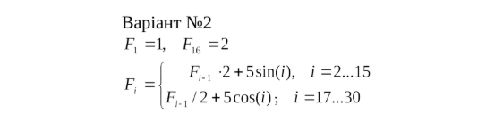
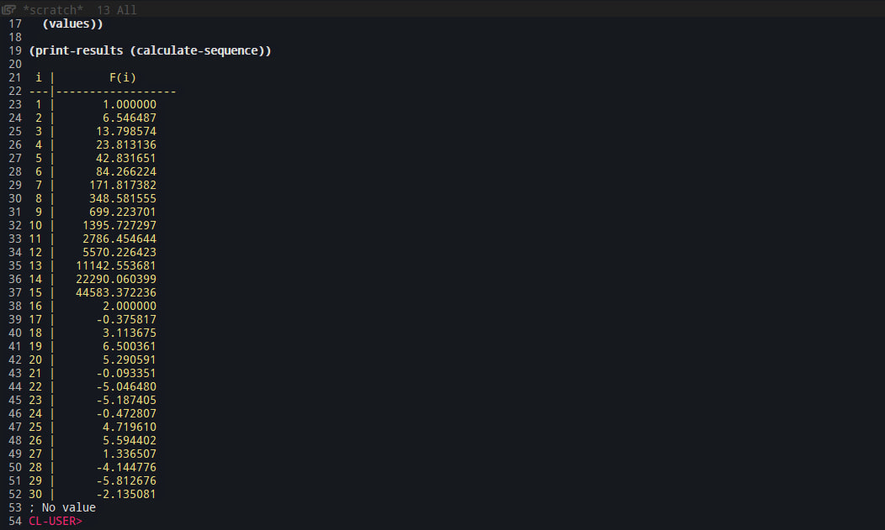
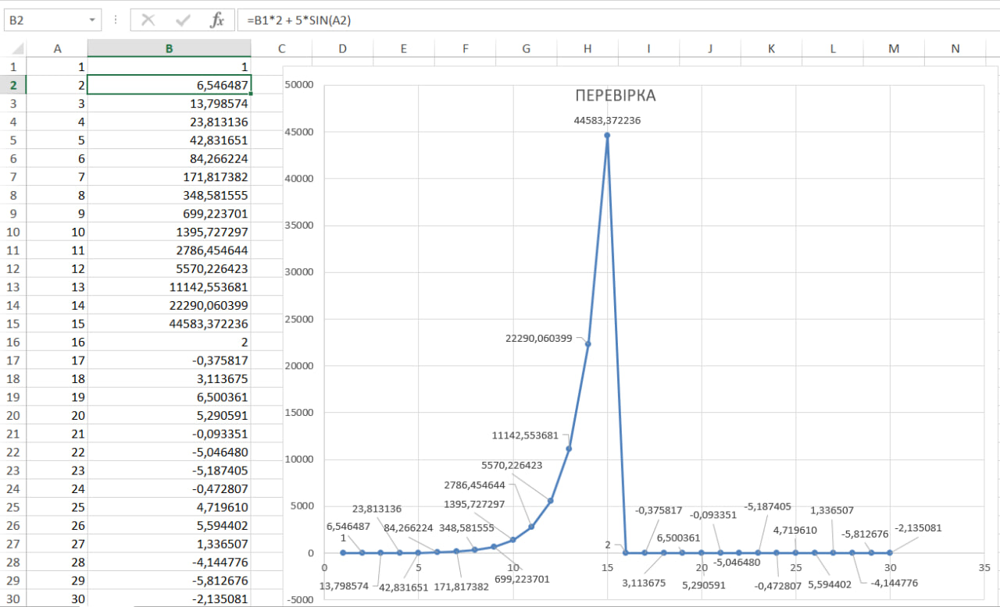

<p align="center"><b>МОНУ НТУУ КПІ ім. Ігоря Сікорського ФПМ СПіСКС</b></p>
<p align="center">
<b>Звіт з Розрахунково-графічної роботи</b>
<br/><br/>
з дисципліни <br/> "Вступ до функціонального програмування"
</p>

<p align="right"><b>Студент: Вакульчук Ярослав Віталійович КВ-22
<p align="right"><b>Рік: 2025

## Завдання на розрахунково-графічну роботу

1. Реалізувати програму для обчислення функції згідно варіанту мовою Common Lisp. Варіант обирається згідно списку варіантів для лабораторних робіт за модулем 16: 1 -> 1, 2 -> 2, ..., 17 -> 1, 18 -> 2 і т.д.
1. Виконати тестування реалізованої програми.
1. Порівняти результати роботи програми мовою Common Lisp с розрахунками іншими засобами.

## Варіант завдання №2

<p align="center">
  
</p>

## Реалізації програми обчислення функції мовою Common Lisp.
```lisp
(defun calculate-sequence ()
  (loop for i from 1 to 30
        with prev = 0d0
        for curr = (cond
                     ((= i 1) 1d0)
                     ((<= i 15) (+ (* prev 2d0) (* 5d0 (sin (float i 1d0)))))
                     ((= i 16) 2d0)
                     (t (+ (/ prev 2d0) (* 5d0 (cos (float i 1d0))))))
        do (setf prev curr)
        collect (cons i curr)))

(defun print-results (data)
  (format t "~% i |        F(i)~%---|------------------~%")
  (dolist (pair data)
    (format t "~2d | ~14,6f~%" (car pair) (cdr pair)))
  (values))

(print-results (calculate-sequence))
```
## Тестування та перевірка за допомогою (Excel)
</b>



